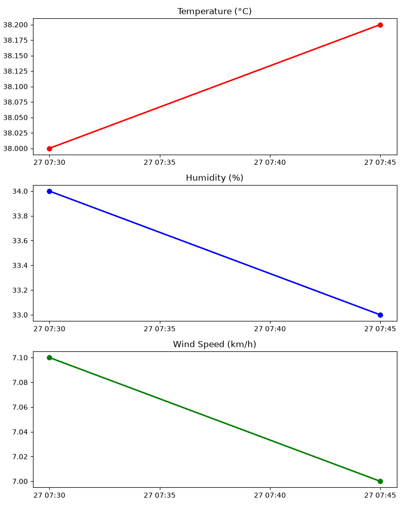

# Weather Data Pipeline — End-to-End ETL with Apache Airflow

An automated end-to-end Data Engineering pipeline that extracts live weather data from a public API, transforms it, loads it into PostgreSQL, generates a visualization, and orchestrates the entire workflow using Apache Airflow.

## Architecture

Open-Meteo Weather API
        |
        v
  extract_weather.py    -->  data/weather_data.csv
        |
        v
  transform_weather.py  -->  data/weather_transformed.csv
        |
        v
  load_postgres.py      -->  PostgreSQL (weather table)
        |
        v
  plot_weather.py        -->  data/weather_chart.png
        |
        v
  Orchestrated by Apache Airflow (DAG: weather_etl_pipeline)

## Tech Stack

- Python — extraction, transformation, loading, visualization
- PostgreSQL (Docker) — data warehouse
- Apache Airflow — workflow orchestration
- Pandas — data transformation
- Matplotlib — chart generation
- Docker / Docker Compose — containerized PostgreSQL
- GitHub Codespaces — development environment

## Project Structure

weather-data-pipeline/
- dags/weather_pipeline_dag.py — Airflow DAG definition
- scripts/extract_weather.py — Pulls live data from weather API
- scripts/transform_weather.py — Cleans and reshapes data
- scripts/load_postgres.py — Loads data into PostgreSQL
- scripts/plot_weather.py — Generates chart from DB data
- data/weather_data.csv
- data/weather_transformed.csv
- data/weather_chart.png
- docker-compose.yml — PostgreSQL container config

## How It Works

1. Extract — Calls the Open-Meteo API to fetch current weather (temperature, humidity, wind speed) and appends it to a CSV.
2. Transform — Cleans and restructures the data (splits datetime, renames columns) using Pandas.
3. Load — Inserts the transformed data into a PostgreSQL weather table.
4. Plot — Generates a 3-panel chart (temperature, humidity, wind speed over time) from the database.
5. Orchestrate — All four steps run automatically, in order, as a single Airflow DAG with one click.

## Running the Project

Start PostgreSQL:
docker compose up -d

Run Airflow (standalone mode):
export AIRFLOW_HOME=$(pwd)
airflow standalone

Open the Airflow UI (default: localhost:8080) and trigger the weather_etl_pipeline DAG.

## Sample Output

## Key Skills Demonstrated

- API integration and data extraction
- ETL pipeline design
- Workflow orchestration with Airflow
- Relational database design and loading
- Data visualization
- Docker containerization